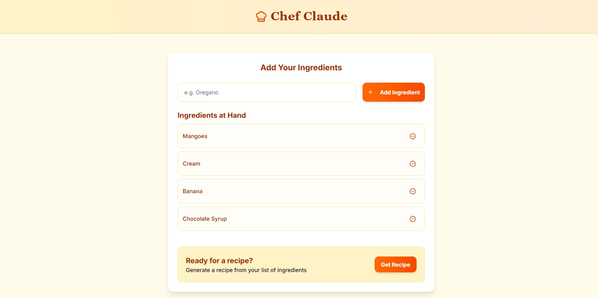
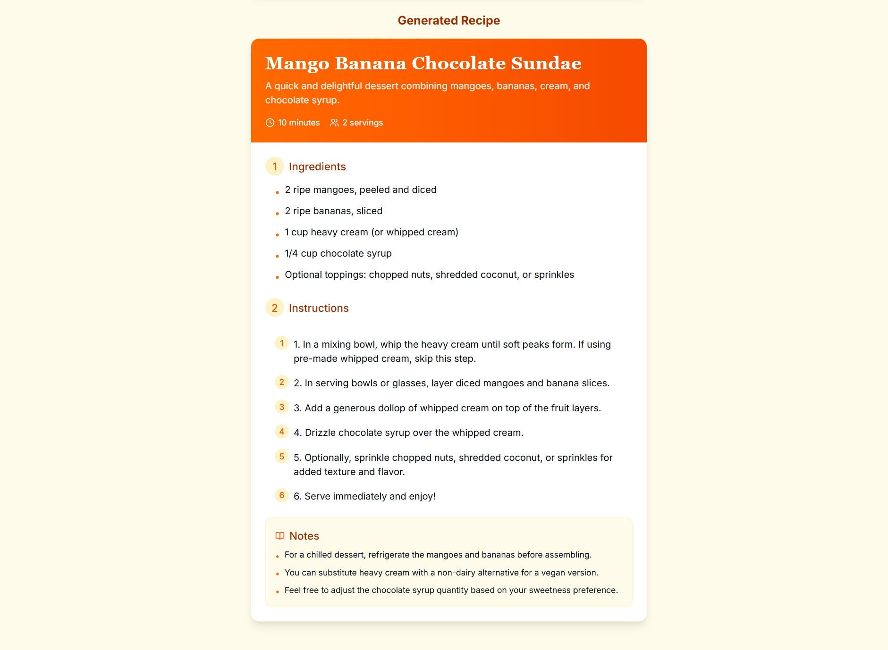

# Chef Claude

Chef Claude is a web application that helps you create recipes based on ingredients you have on hand. Simply input your available ingredients, and Chef Claude will generate a delicious recipe tailored to what you have in your kitchen.

## Features

- **Ingredient Management**: Easily add ingredients you have available
- **AI-Powered Recipe Generation**: Get creative recipes based on your ingredient list
- **Detailed Recipe Output**: Complete with ingredients, instructions, and helpful notes
- **Responsive Design**: Works on desktop and mobile devices
- **Clean, Intuitive UI**: Built with Tailwind CSS and shadcn/ui components

## Screenshots





Check out the live demo [here](https://chef-claude-sage.vercel.app/)

## Tech Stack

- **Next.js 15**: React framework for production
- **Tailwind CSS**: Utility-first CSS framework
- **shadcn/ui**: High-quality UI components
- **Perplexity AI API**: Powers the recipe generation
- **Bun**: JavaScript runtime & package manager

## Installation

1. Clone the repository:
   ```bash
   git clone https://github.com/undead-reaper/chef-claude.git
   cd chef-claude
   ```

2. Install dependencies:
   ```bash
   bun install
   ```

3. Create a `.env.local` file in the root directory with your Perplexity API key:
   ```
   PERPLEXITY_API_KEY=your_api_key_here
   ```

4. Start the development server:
   ```bash
   bun --bun run dev
   ```

5. Open [http://localhost:3000](http://localhost:3000) in your browser to see the application.

## Environment Variables

| Variable | Description |
|----------|-------------|
| `PERPLEXITY_API_KEY` | Your Perplexity AI API key (required) |

## Deployment

This project is configured for easy deployment on Vercel. Connect your GitHub repository to Vercel and it will automatically deploy when you push changes.

Don't forget to add your environment variables in the Vercel dashboard.

## License

This project is licensed under the [GNU General Public License v3.0](LICENSE).

## Contributing

While there are no specific contribution guidelines at this time, feel free to submit pull requests if you have ideas for improvements or new features.

## Acknowledgements

- Powered by [Perplexity AI](https://www.perplexity.ai/)
- Built with [Next.js](https://nextjs.org/)
- Styled with [Tailwind CSS](https://tailwindcss.com/)
- UI components from [shadcn/ui](https://ui.shadcn.com/)
